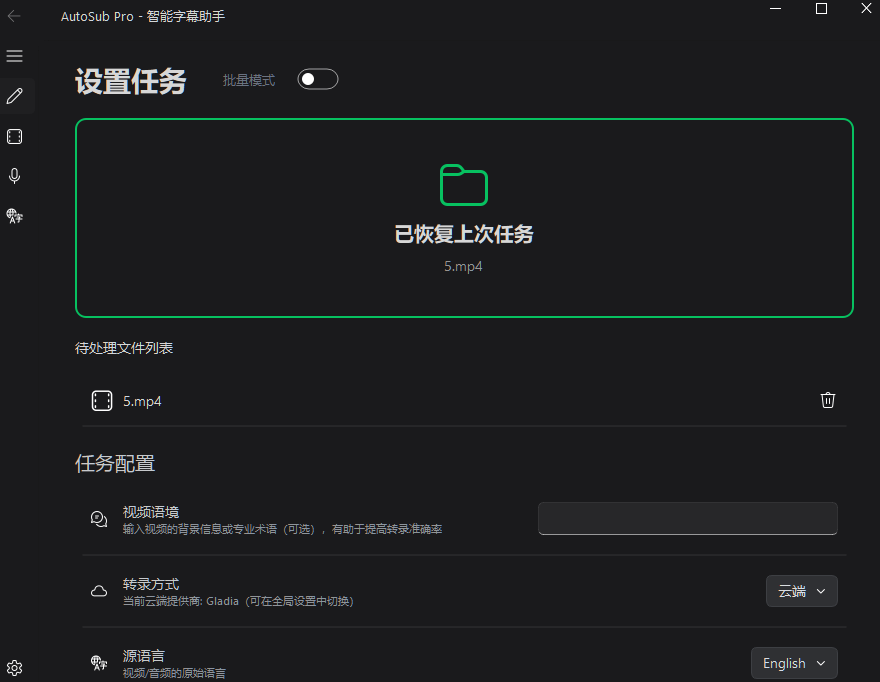
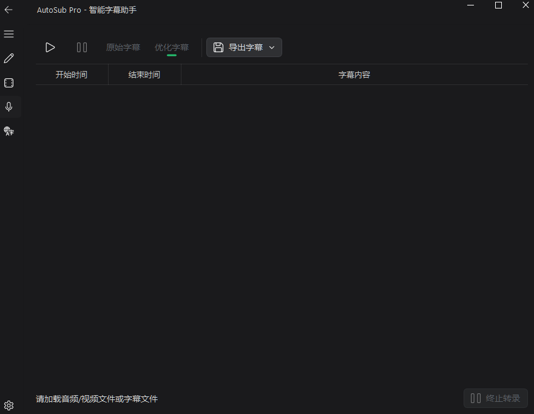
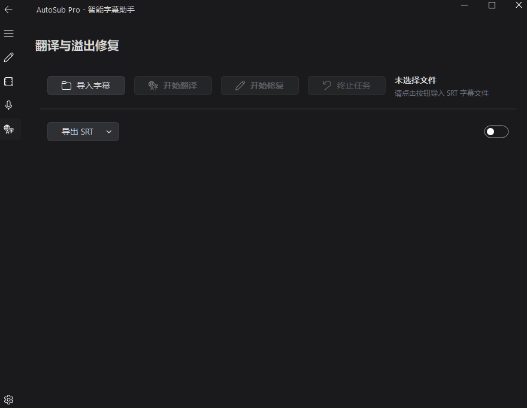

# AutoSub Workflow

English | [中文](README.zh-CN.md)

AutoSub Workflow is a desktop subtitle production workbench for creators who need more than a raw transcript. It connects transcription, cleanup, semantic splitting, translation, overflow repair, and export into one repeatable workflow.



## Why It Exists

Subtitle production often breaks across too many tools: one app for transcription, another prompt for cleanup, another pass for translation, and a final manual check for lines that overflow in the editor. AutoSub brings those steps into a single desktop flow so a video can move from source media to deliverable subtitle files with less hand stitching.

## Highlights

- **Cloud or local transcription** with Gladia, Whisper-compatible APIs, and local faster-whisper workflows.
- **AI cleanup** for noisy transcript fragments, repeated phrases, punctuation issues, and suspicious segments.
- **Semantic subtitle splitting** that uses meaning, pauses, and length limits to create more readable subtitles.
- **Context-aware translation** with video context, glossary hints, and semantic maps.
- **Overflow repair** for subtitle boxes used in editing workflows.
- **Export-ready outputs** including SRT, VTT, ASS, production notes, reports, and logs.
- **Realtime capture support** for system-audio capture scenarios.





## Releases

Two Windows builds are available:

- **Cloud Lite**: smaller package for users who mainly rely on cloud transcription, translation, and splitting. It includes ffmpeg for media extraction, but excludes local Whisper inference components.
- **Full**: complete package for users who need local Whisper / faster-whisper transcription support. Larger download, more bundled runtime pieces.

Download:

- [Cloud Lite](https://github.com/wzhou9721-blip/autosub-workflow/releases/tag/v1.0.0-cloud-lite)
- [Full](https://github.com/wzhou9721-blip/autosub-workflow/releases/tag/v1.0.0)

## Typical Workflow

1. Import a video or audio file.
2. Choose cloud or local transcription.
3. Add video context, source language, target language, and glossary hints.
4. Enable cleanup, semantic splitting, translation, and overflow repair as needed.
5. Run the task and review the result.
6. Export subtitles, quality reports, and runtime logs.

## Project Layout

```text
AutoSub/
  app/                    Application source code
  main.py                 Desktop app entry point
  autosub_cli.py          CLI worker entry point
  AutoSub.spec            Full build configuration
  AutoSub_cloud_lite.spec Cloud Lite build configuration
  requirements.txt        Windows/dev dependencies
  config.example.json     Safe example config without API keys
  docs/screenshots/       Project screenshots
  启动.bat                Windows launcher
```

## Development Setup

Python 3.11 or 3.12 is recommended.

```powershell
python -m venv .venv
.\.venv\Scripts\python.exe -m pip install --upgrade pip
.\.venv\Scripts\python.exe -m pip install -r AutoSub\requirements.txt
```

Create your local config from the example:

```powershell
Copy-Item AutoSub\config.example.json AutoSub\config.json
```

Then edit `AutoSub/config.json` locally with your API keys, model names, language preferences, and workflow switches. This file may contain private credentials and is intentionally ignored by Git.

Run the development app:

```powershell
.\.venv\Scripts\python.exe AutoSub\main.py
```

Run regression checks:

```powershell
.\.venv\Scripts\python.exe AutoSub\run_regression.py
```

## Packaging

Full build:

```powershell
cd AutoSub
..\.venv\Scripts\python.exe -m PyInstaller AutoSub.spec --noconfirm --clean
```

Cloud Lite build:

```powershell
cd AutoSub
..\.venv\Scripts\python.exe -m PyInstaller AutoSub_cloud_lite.spec --noconfirm --clean
```

## Notes

- Cloud transcription, translation, optimization, context enhancement, and overflow repair require the corresponding API keys in `AutoSub/config.json`.
- Cloud Lite does not bundle local Whisper inference components. Choose the Full build if local transcription is required.
- Runtime logs, temporary resume files, local configs, model files, and captured session data are ignored by Git.
