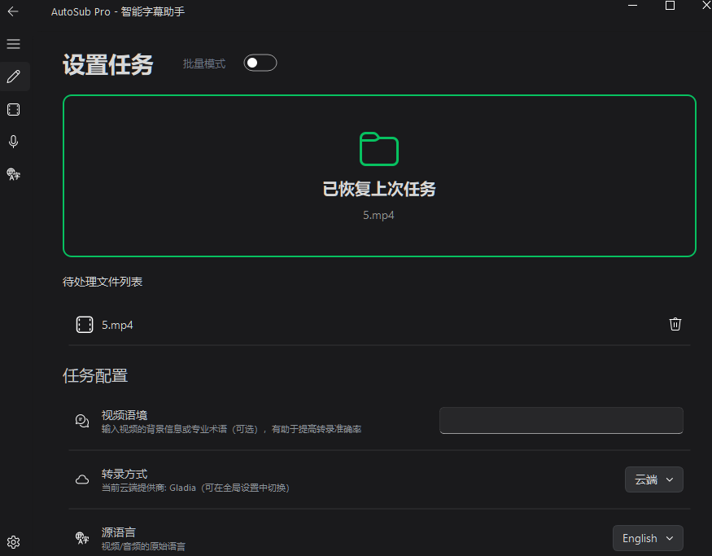
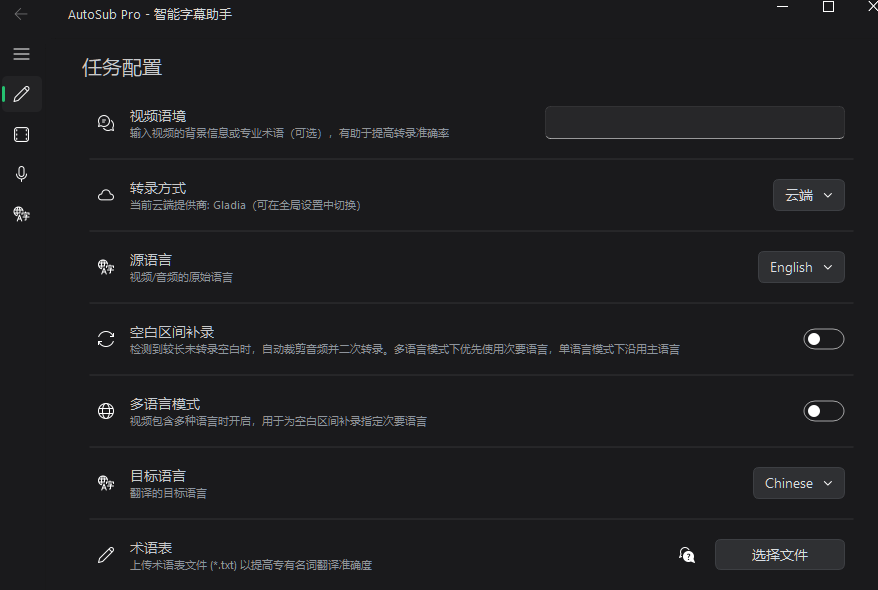
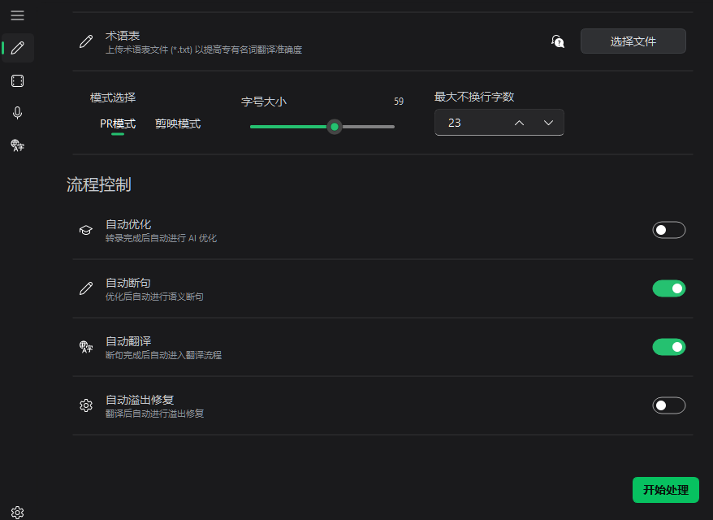
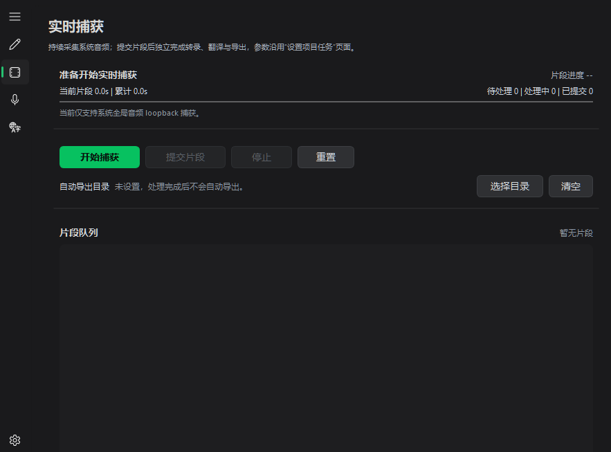
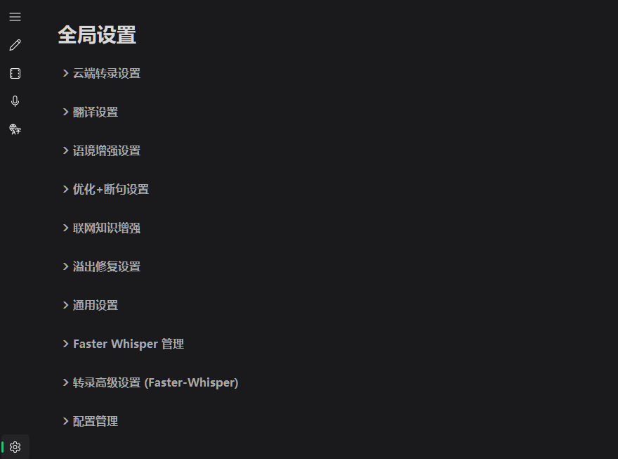

<p align="center">
  
</p>

<h1 align="center">AutoSub Workflow</h1>

<p align="center">
  面向创作者的智能字幕工作流工具：转录、断句、翻译、溢出修复与导出，一条流程跑完。
</p>

<p align="center">
  <a href="README.md">English</a> · 中文 ·
  <a href="https://github.com/wzhou9721-blip/autosub-workflow/releases/tag/v1.0.0-cloud-lite">下载 Cloud Lite</a> ·
  <a href="https://github.com/wzhou9721-blip/autosub-workflow/releases/tag/v1.0.0">下载 Full</a>
</p>



## 项目介绍

AutoSub Workflow 是一款桌面端字幕生产工具，适合短视频、体育剪辑、访谈、会议录屏和多语言素材处理。它不是只做“语音转文字”，而是把字幕生产中最容易反复返工的环节放到同一条流程里：先转录，再清理，再按语义断句，随后翻译、检查字幕溢出，最后导出 SRT / VTT / ASS 和过程报告。

如果你经常遇到这些问题，AutoSub 会更有用：

- 多语言视频里，某些语言容易被漏听。
- 云端转录能出文字，但断句和时间轴还需要整理。
- 翻译后字幕太长，导入剪辑软件后经常自动换行。
- 需要按 PR / 剪映等不同字幕样式控制单行字数。
- 想把视频字幕、翻译、溢出修复和导出放在一个桌面流程里处理。

## 核心功能

- **转录**：支持云端转录，也支持 Full 版中的本地 faster-whisper 工作流。
- **字幕优化**：清理重复片段、异常标点、幻觉文本和不自然分段。
- **智能断句**：结合语义、停顿和长度限制，把转录结果整理成更适合观看的字幕。
- **字幕翻译**：结合视频语境、术语表和语义结构，减少专有名词和上下文翻译错误。
- **溢出修复**：按字幕样式和最大不换行字数拆分字幕，减少导入剪辑软件后的换行问题。
- **实时捕获**：可捕获系统音频并分段转录、翻译和导出，适合直播、会议和长素材监听场景。
- **导出**：支持 SRT、VTT、ASS、新闻稿、质量报告和运行日志。

## 我们的优势

### 1. 更重视多语言素材的漏听问题

AutoSub 在任务配置里提供了多语言模式和空白区间补录。对于双语、混合语种、采访切换、体育解说等素材，普通转录容易在语言切换或长停顿后漏掉一段内容；AutoSub 会围绕这些空白区间做补录和补救，尽量降低漏听概率。



### 2. 为剪辑软件里的字幕换行做了专门适配

很多工具把字幕翻译完就结束了，但真正导入剪辑软件后，问题才开始出现：一行太长、自动换行、遮挡画面、PR 和剪映表现不一致。AutoSub 提供 PR 模式 / 剪映模式、字号、最大不换行字数和自动溢出修复，让字幕更接近实际交付状态。



### 3. 可以做系统音频实时捕获

AutoSub 支持捕获系统音频，把直播、会议、网页视频等声音按片段处理，并继续接入转录、翻译和导出流程。这个能力更偏工作流辅助：需要手动提交片段，也会存在一定延迟，但适合需要边听边整理字幕素材的场景。



### 4. 全局设置集中管理

云端转录、翻译、语境增强、优化断句、联网知识增强、溢出修复、本地 faster-whisper 和配置管理都集中在全局设置里。常用流程可以固定下来，不需要每次重新搭一套参数。



## 下载哪个版本

- **Cloud Lite 版**：体积更小，适合主要使用云端转录、翻译和断句的用户。内置 ffmpeg，但不包含本地 Whisper 推理组件。
- **Full 版**：功能完整，适合需要本地 Whisper / faster-whisper 转录能力的用户。体积更大，但解压后组件更齐。

发布页：

- [Cloud Lite 版](https://github.com/wzhou9721-blip/autosub-workflow/releases/tag/v1.0.0-cloud-lite)
- [Full 版](https://github.com/wzhou9721-blip/autosub-workflow/releases/tag/v1.0.0)

## 使用流程

1. 导入视频、音频或字幕文件。
2. 选择云端或本地转录方式。
3. 填写视频语境、源语言、目标语言和术语表。
4. 按需开启 AI 优化、智能断句、自动翻译和溢出修复。
5. 运行任务并检查结果。
6. 导出字幕文件、质量报告和运行日志。

## 本地开发

建议使用 Python 3.11 或 3.12。

```powershell
python -m venv .venv
.\.venv\Scripts\python.exe -m pip install --upgrade pip
.\.venv\Scripts\python.exe -m pip install -r AutoSub\requirements.txt
```

从示例配置创建本地配置：

```powershell
Copy-Item AutoSub\config.example.json AutoSub\config.json
```

然后在 `AutoSub/config.json` 中填写自己的 API Key、模型名称、语言偏好和工作流开关。这个文件可能包含私密密钥，已经被 Git 忽略，请不要提交。

启动开发版：

```powershell
.\.venv\Scripts\python.exe AutoSub\main.py
```

## 打包

Full 版：

```powershell
cd AutoSub
..\.venv\Scripts\python.exe -m PyInstaller AutoSub.spec --noconfirm --clean
```

Cloud Lite 版：

```powershell
cd AutoSub
..\.venv\Scripts\python.exe -m PyInstaller AutoSub_cloud_lite.spec --noconfirm --clean
```

## 说明

- 云端转录、翻译、优化、语境增强和溢出修复需要配置对应 API Key。
- Cloud Lite 版不包含本地 Whisper 组件，选择本地转录时会提示下载 Full 版或安装本地组件。
- 本地模型、运行日志、临时断点文件、用户配置和实时捕获数据默认不会提交到 Git。
